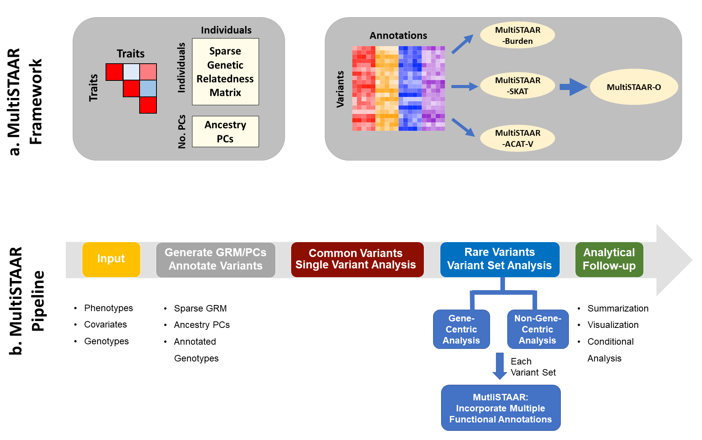

[](https://github.com/xihaoli/MultiSTAAR/actions)
[](https://ci.appveyor.com/project/xihaoli/multistaar/branch/main)
[](https://www.gnu.org/licenses/gpl-3.0)

# MultiSTAAR (Multi-trait variant-Set Test for Association using Annotation infoRmation)
This is an R package for performing MultiSTAAR procedure in whole-genome sequencing studies.
## Description
MultiSTAAR is an R package for performing Multi-trait variant-Set Test for Association using Annotation infoRmation (MultiSTAAR) procedure in whole-genome sequencing (WGS) studies. MultiSTAAR is a general framework that (1) leverages the correlation structure between multiple phenotypes to improve power of multi-trait analysis over single-trait analysis, and (2) incorporates both qualitative functional categories and quantitative complementary functional annotations using an omnibus multi-dimensional weighting scheme. MultiSTAAR accounts for population structure and relatedness, and is scalable for jointly analyzing large WGS studies of multiple correlated traits.
## Workflow Overview

## Prerequisites
<a href="https://www.r-project.org">R</a> (recommended version >= 3.5.1)

For optimal computational performance, it is recommended to use an R version configured with the Intel Math Kernel Library (or other fast BLAS/LAPACK libraries). See the <a href="https://software.intel.com/en-us/articles/using-intel-mkl-with-r">instructions</a> on building R with Intel MKL.
## Dependencies
MultiSTAAR links to R packages <a href="https://cran.r-project.org/web/packages/Rcpp/index.html">Rcpp</a>, <a href="https://cran.r-project.org/web/packages/RcppArmadillo/index.html">RcppArmadillo</a> and <a href="https://https://github.com/xihaoli/STAAR">STAAR</a>, and also imports R packages <a href="https://cran.r-project.org/web/packages/Rcpp/index.html">Rcpp</a>, <a href="https://cran.r-project.org/web/packages/GMMAT/index.html">GMMAT</a>, <a href="https://bioconductor.org/packages/release/bioc/html/GENESIS.html">GENESIS</a>, <a href="https://https://github.com/xihaoli/STAAR">STAAR</a>, <a href="https://cran.r-project.org/web/packages/Matrix/index.html">Matrix</a>. These dependencies should be installed before installing MultiSTAAR.
## Installation
```
library(devtools)
devtools::install_github("xihaoli/MultiSTAAR",ref="main")
```
## Usage
Please see the <a href="docs/MultiSTAAR_manual.pdf">**MultiSTAAR** user manual</a> for detailed usage of MultiSTAAR package. Please see the <a href="https://github.com/xihaoli/STAARpipeline-Tutorial">**STAARpipeline** tutorial</a> for a detailed example of analyzing sequencing data using MultiSTAAR.
## Data Availability
The whole-genome functional annotation data assembled from a variety of sources and the precomputed annotation principal components are available at the [Functional Annotation of Variant - Online Resource (FAVOR)](https://favor.genohub.org) site and [FAVOR Essential Database](https://doi.org/10.7910/DVN/1VGTJI).
## Version
The current version is 0.9.7 (October 30, 2023).
## License
This software is licensed under GPLv3.


[GNU General Public License, GPLv3](http://www.gnu.org/copyleft/gpl.html)
